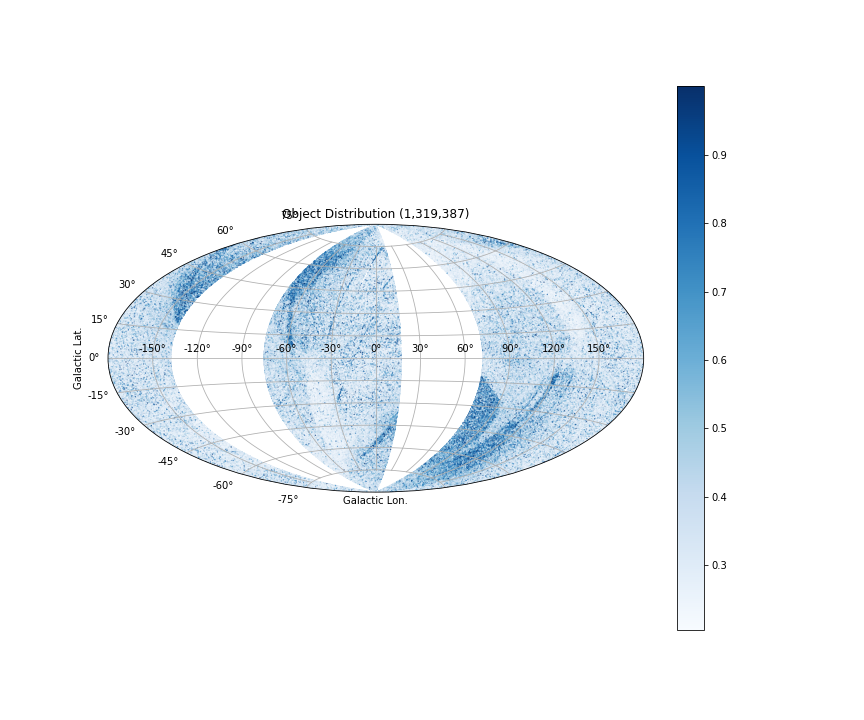

# Data Selection

For Gaia DR1 (afterward *GDR1*) data, our data selection critiria are based on position, colour and distance

## Position

- Galatic longitudes: **l** < 17, or **l** > 285, or (**l** > 72 && *l* < 222).
- Galatic latitudes: **NO USE**

## Colour

Because GDR1 does not have colour information, we need to cross-match the external catalogue(s) containing such info.

Gaia/ESA has already generated several pre-cross-matched catalogues([1]), from which we select those have good coverage of the galactic plane regions,

* UCAC4, [Zacharias et al. 2013](https://ui.adsabs.harvard.edu/#abs/2013AJ....145...44Z/abstract):
The photometry data is from 2MASS (J, K, B, V) and APASS (r, i)

* GSC 2.3, [Lasker et al. 2008](https://ui.adsabs.harvard.edu/#abs/2008AJ....136..735L/abstract): 
The photometry bands: Bj, B, V, U, N (IR)

* PPMXL, [Roeser et al. 2010](https://ui.adsabs.harvard.edu/#abs/2010AJ....139.2440R/abstract):
The Photometry data is from 2MASS (IR: J, H, Ks) and USNO-B1.0 (Optical: B, R, I)

* 2MASS PSC [Skrutskie et al. 2006](https://ui.adsabs.harvard.edu/#abs/2006AJ....131.1163S/abstract):

* allWISE [Cutri & et al. 2013](https://ui.adsabs.harvard.edu/#abs/2013yCat.2328....0C/abstract):
This is an infra-red survey, so we will not use the data here.

To save time, we trust that "the Best Neighbour" cross-match table ([1]) indeed provides the best match for us.

## Distance

Although parallax is the inverse of distance **r**, we cannot apply this relationship directly to obtain the distance, because what we really have is a *measured* value of parallax which does not refer to the true distance and the uncertainty of the parallax can distort the distance estimation greatly (see [Bailer-Jones, 2015]).

The likelihood of a measured parallax referring to true distance can only work well if the ratio of parallax error to parallax (*f*) is smaller enough. In such case, the distance and its uncertainty estimated by a measurement model is quite acceptable.

In this work, we need to select the objects within 3 kpc. In GDR1, only primary objects (~2M, [2]) have parallax values and they are generally bright (< 14 G mag), we can use the model to find out the distance without too much problem.
 
Here, we set parallax > 0([3]) and  *f <= 0.2* as the criteria to further select the data, see the figure below,

However, we will need a better way to treat the DR2 data as most of them will have parallax values outside the comfort zone of the model, this will be the next step.

## Summary

 

The figure above shows the objects been selected according to not only the position but also the colour and parallax. 

The figure above show the photometry distribution of the selected data.

[1]: https://arxiv.org/abs/1710.06739  "Gaia Data Release 1. Cross-match with external catalogues - Algorithm and results"

[2]: These are Tycho sources with the combined Hipparcos and Gaia astrometric solutions. 

[Bailer-Jones, 2015]: https://ui.adsabs.harvard.edu/#abs/2015PASP..127..994B/abstract

[3]: The negative value of a measured parallax probably refers to distance star.