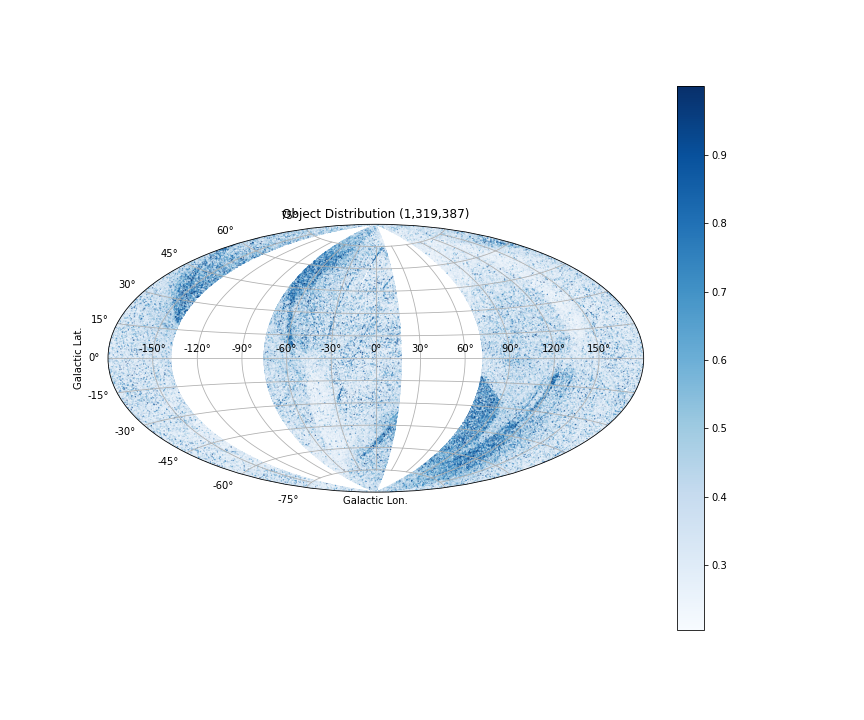
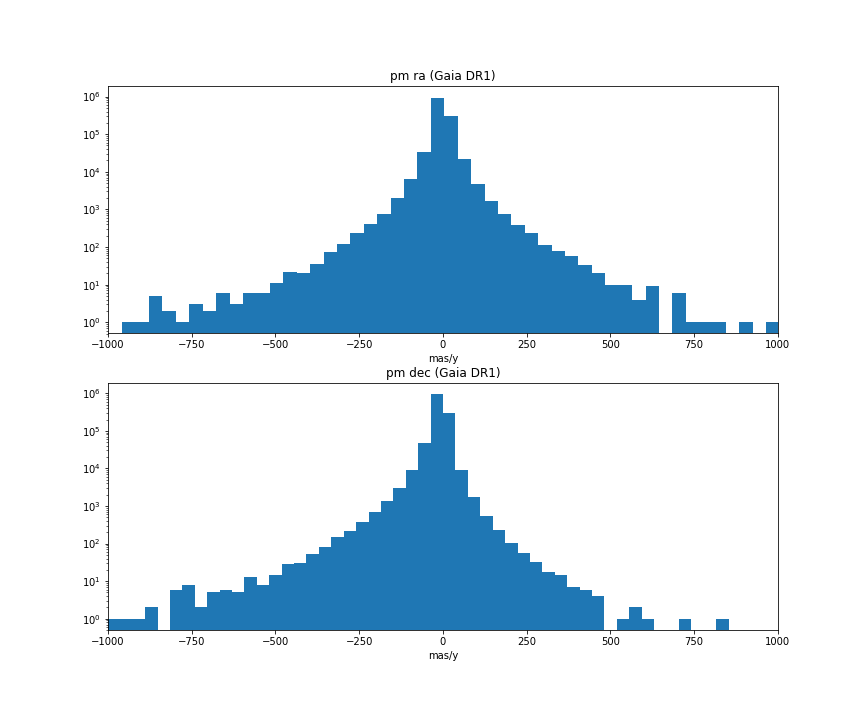
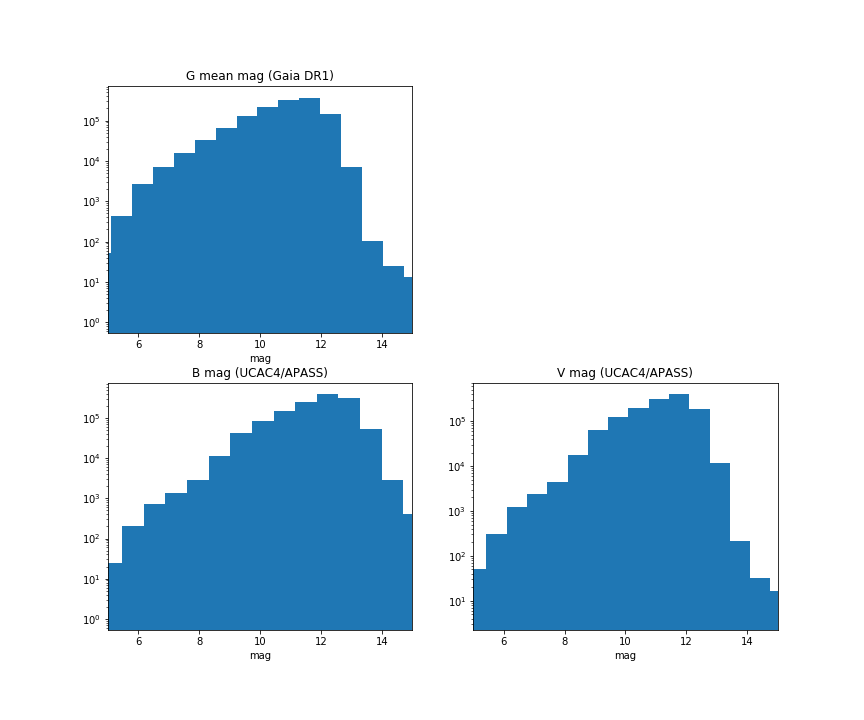
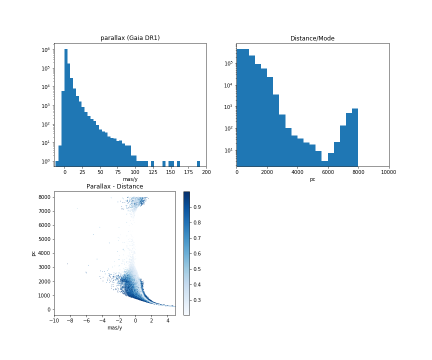

# SpiralArm

## Gaia DR1 - UCAC4 dataset

The file contains the cross-matched Gaia DR1 - UCAC4 data, the distance measurement is also included using the data provided by Astraatmadja and Bailer-Jones (ApJ 833, 119, 2016).

## Data Column Definition

| name | description |
| --- | ---|
| id | series number |
| sourceid | Gaia DR1 source identifier |
| l | Galactic Longitude (degree) |
| b | Galactic Latitude (degree) |
| ra | Barycentric right ascension (degree) |
| raerror | Standard error of R.A. (degree) |
| dec | Barycentric declination (degree) |
| decerror | Standard error of Dec. (degree) |
| pmra | Proper motion in right ascension (mas/yr) |
| pmraerror | Standard error of the PM in R.A. (mas/yr) |
| pmdec | Proper motion in declination (mas/yr) |
| pmdecerror | Standard error of the PM in Dec. (mas/yr) |
| parallax | Absolute barycentric stellar parallax (mas) |
| parallaxerror | Standard error of the stellar parallax (mas) |
| photgmeanmag | Mean magnitude in the G band (mag) |
| ucac4id | UCAC4 recommended identifier | 
| bmag | B magnitude from APASS (mag) |
| vmag | V magnitude from APASS (mag) |
| distance | Mode distance of the posterior, using Milky Way Prior (pc) |
| distance_error | Distance standard error, using Milky Way Prior (pc) |

The reference epoch of the objects is 2015 (Julian Year in TCB)

## Summary

- Object Distribution is Sky
 
There are 1,319,387 objects and their distrbution is the sky. The colour map indicates the normalised parallax error of the objects.

- Proper Motion Distribution

Many of the error value of the proper motion in declination are zero, I don't know why, so please be cautious if you need the error value.

- Magnitude Distribution

The magnitude distribution of the data lean toward to brighter stars because they are the TGAS sources with proper motion and parallax. In DR2, you will expect more fainter stars and direct colour information from Gaia as well. Using external catalogue(s) for colour is unnecessary.

- Parallax and distance measurement

The distance measurement greater than ~6000 pc seems to be problematic, please check the method used by Astraatmadja and Bailer-Jones (2016). The colour map in the Parallax-Distance sub figure is also the normalised parallax error.

